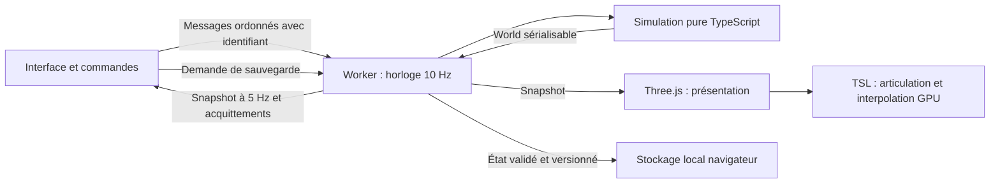

# Architecture et décisions

## Objectif

Obtenir une simulation de colonie déterministe, observable et indépendante de sa représentation 3D. Les événements émergent des règles de travail, de survie et de vie sociale. La fidélité à la référence est documentée par domaine ; la première tranche ne tente pas de livrer tous ces domaines simultanément.

## Frontières et flux

Le worker exécute des ticks fixes de 100 ms. Les vitesses modifient le nombre de ticks, jamais leur signification. Un retard réel est plafonné à 250 ms par passage et à 15 ticks par lot : après suspension du navigateur, le jeu ralentit au lieu de tenter de rattraper des heures. Aucun jour de simulation n'est sauté dans le noyau. Cette politique concerne le temps réel, pas les règles du monde.

Les messages sont traités en séquence dans un worker unique. Chaque commande reçoit une réponse ; un échec est affiché. Un checkpoint complet initialise ou remplace une carte ; les publications suivantes, au plus toutes les 200 ms pendant la marche et après une demande réussie, transportent l'état dynamique et les changements de terrain/ressources. Le client reconstruit un monde complet pour ses observateurs sans recopier les tableaux inchangés. L'application propose 64/128/200/250 cases par côté, défaut 250 ; les anciennes petites cartes sont conservées. Le protocole, ses révisions et les coûts encore complets sont précisés dans ADR-013.

## ADR-001 — Grille de gameplay plane, représentation 3D

**Adopté.** Les cellules utilisent x/z et une grille row-major. Les coordonnées des personnages sont entières dans la simulation. Le rendu interpole leurs déplacements ; sa hauteur n'ajoute pas d'étage navigable. Les volumes low poly facilitent les angles de caméra, mais les chemins et l'occupation restent faciles à vérifier. Étages, escaliers et terrain déformable exigeraient une décision séparée.

## ADR-002 — TypeScript strict dans un worker

**Adopté.** Three.js, DOM et horloge sont absents du noyau. Les modules `engine`, `pathfinding` et `serialization` permettent tests headless et un remplacement ciblé. Le modèle utilise des tableaux d'entités typées plutôt qu'un framework ECS généraliste. À cette échelle, l'absence de dépendances et la lisibilité priment ; les futurs index spatiaux et tableaux SoA peuvent être introduits derrière l'API.

Un worker garde le thread d'interface disponible ; ce choix n'accélère pas magiquement le calcul total. Les échanges ont un coût. Les deltas révisionnés d'ADR-013 évitent désormais la copie récurrente des données inchangées. Buffers transférables et pools restent à évaluer si leurs gains justifient leur complexité. Voir [la documentation des workers](https://developer.mozilla.org/en-US/docs/Web/API/Web_Workers_API/Using_web_workers).

## ADR-003 — Three.js WebGPURenderer et TSL

**Adopté.** Three 0.186.0, Vite 8.3.0, TypeScript 7.0.2, Vitest 5.0.0, Playwright 1.63.0 et types Three 0.186.0 : tags npm stables vérifiés le 13 septembre 2026, puis versions exactes installées et verrouillées. Node local : 24.11.1. Aucun tag flottant `latest` à l'exécution.

L'import `three` est redirigé exactement vers `three/webgpu` pour éviter deux instances avec les addons. Les graphes de matériaux sont construits une fois. Le backend réel est diagnostiqué après initialisation ; un repli WebGL 2 est possible pour les fonctions présentes. Les futures passes compute seront activées selon capacités et n'auront pas une parité supposée sur tous les backends. Voir [WebGPURenderer](https://threejs.org/manual/en/webgpurenderer) et [TSL](https://threejs.org/docs/TSL.html).

## ADR-004 — Animation GPU, simulation CPU

**Adopté pour les placeholders.** Un rig de six segments rigides, un poids par sommet, pivots de bind et articulation TSL remplace les personnages. La simulation transmet position et état ; aucune hiérarchie d'os n'est animée sur CPU à chaque image. L'interpolation visuelle n'influence ni collision, ni faim, ni réservation.

**Prévu pour les glTF.** Pré-échantillonner des clips dans un atlas d'os ; comparer palette compute partagée et skinning vertex. Les animaux peuvent bénéficier de VAT. L'audit Antsystem démontre un pipeline VAT préparé sur CPU au chargement puis exploité GPU, et non un moteur universel de squelettes entièrement évalués sur GPU. Les décisions détaillées, limites de normales, LOD et ombres sont dans [la recherche de rendu](../research/rendering-and-performance.md).

## ADR-005 — Ressources et réservations explicites

**Adopté, réalisé dans le schéma 2.** Le stock global autoritaire de la première tranche est remplacé par des piles physiques avec propriétaire unique : sol, porteur ou chantier. Collecte, transport et construction sont des familles séparées. Les tâches réservent une quantité source et une capacité de destination, puis exécutent prélèvement, portage et dépôt. Le constructeur attend les matériaux réellement livrés. `stock` et `job.escrow` sont désormais des vues contrôlées, sans double comptage.

Interrompre libère les engagements futurs ; la cargaison est déposée au colon et les matériaux déjà livrés restent au chantier. Annuler un plan dépose ses matériaux sur place ; achever incorpore ces quantités au bâtiment. Les stockages sont encore des cellules indépendantes avec filtres, priorité et capacité. Le plan de mur bloque le passage dès sa désignation ; déplacement automatique des objets, zones communes et étapes de chantier plus fines restent ouverts. Contrat : [material-logistics.md](material-logistics.md) ; adaptations : [decisions.md](../gameplay/decisions.md).

## ADR-006 — Sauvegarde versionnée

**Adopté, schéma 2 courant avec migration explicite depuis 1.** Le JSON contient graine et RNG, tick, IDs, grille, entités, piles et propriétaires, stockages, orientations, tâches de transport, routes, cadences, réservations, `logisticsCursor` et événements. L'entrée est validée comme `unknown`, avec bornes, identités uniques, vues dérivées et cohérence des liens. Le chargement est préparé dans une variable temporaire et n'écrase le monde qu'après validation.

La migration valide d'abord le schéma 1. Le stock global devient des piles déterministes près du camp, l'escrow devient de la matière livrée ; les priorités existantes sont conservées et Transport reçoit 3. Les anciens lits gardent une empreinte `legacy-single` 1×1 sans déplacer les voisins. Une construction interrompue V1 peut conserver sa progression sans escrow : elle doit être réapprovisionnée avant de poursuivre. Terrain et IDs existants ne sont pas régénérés. L'égalité de continuation s'applique au schéma 2, sans promesse de reproduire le futur de l'ancien moteur.

Le renderer et la vitesse de lecture ne font pas partie du résultat métier sauvegardé. Sauvegarder n'arrête pas le jeu ; l'état correspond au traitement de la demande dans le worker. Les clés `lisiere.save.v1` et `lisiere.previous.v1` sont conservées pour retrouver les parties existantes ; le schéma est dans le JSON. Créer une colonie écrit d'abord la copie précédente et refuse le remplacement si cette écriture échoue. Export/import, autosauvegardes tournantes, manifeste de contenu/générateur et migrations ultérieures restent à développer.

## ADR-007 — Rust/WASM et compute selon mesures

**Reporté avec critères.** Envisager Rust pour navigation, régions ou diffusion si un profil représentatif dépasse le budget après optimisation algorithmique. Comparer mêmes entrées et mêmes résultats, coût JS↔WASM inclus, appels par lots. Commencer monothread dans le worker ; SharedArrayBuffer et rayon impliquent isolation cross-origin et protocole atomique.

Pour le GPU, commencer par quelques centaines d'acteurs représentatifs avant culling/compaction/indirect. Mesurer séparément simulation, échanges, soumission et temps GPU. Aucun objectif de performance ne devient une garantie sans appareil et scénario de référence. Voir [le protocole de benchmark](../research/rendering-and-performance.md#protocole-de-validation-et-de-benchmark).

## ADR-008 — Dimensions, topologie et génération

**Adopté.** `src/world/scale.ts` centralise la conversion 1 case = 1 m, les dimensions humaines et architecturales, la coupe des murs et les chunks de rendu de 16 cases. La caméra conserve un cadrage local indépendant de la taille du monde ; son angle initial d'environ 58° au-dessus du sol limite l'occultation des colons par les arbres, et reste librement orientable. Les lots par chunk permettent leur culling. Les ombres suivent le cadrage local. Ces choix ne transforment pas la grille plane en relief navigable.

`src/sim/generation.ts` produit des champs spatiaux déterministes, une rivière continue, des massifs et un couvert végétal corrélé. La validation examine topologie, densité et accès du départ, et non une simple image de seed 42. Voir [world-generation.md](world-generation.md). La sauvegarde conserve chaque case et ressource : changer le générateur ne modifie pas les anciennes parties. Le schéma de données est 2 ; une version explicite de générateur reste à ajouter et une graine seule ne rejoue pas un ancien algorithme.

Les nouveaux lits ont une empreinte orientée 1×2 partagée entre placement, inspection, accès au périmètre et rendu, via `footprintCells`. Les orientations 0/1/2/3 étendent la seconde cellule vers +z/+x/−z/−x. Les lits sont encore franchissables ; leur emprise interdit les constructions et stockages superposés. Les lits V1 conservent explicitement une emprise 1×1. Les meshes ne décident pas de l'occupation ; voir [les conventions spatiales](../research/spatial-design.md) et ADR-012.

## ADR-009 — Organisation de l'interface de référence

**Adopté, demande utilisateur.** Carte en fond, portraits en haut, ressources à gauche, alertes à droite, inspection en bas à gauche, onglets en bas, temps en bas à droite. `src/ui/layout.ts` définit le squelette et les catégories ; `main.ts` branche les commandes et snapshots. Architecte, Travail, Historique et Menu sont mutuellement exclusifs. Les domaines non livrés restent désactivés, à leur emplacement de référence. Le style est propre au projet.

Les données chargées (noms, journal) sont affichées avec `textContent` ; aucun HTML de sauvegarde n'est exécuté. Les boutons et raccourcis transmettent les mêmes commandes au worker. Les préférences de coupe des murs/feuillage sont visuelles. Sur petite fenêtre, les onglets défilent horizontalement. Les observations et limites de fidélité sont consignées dans [la référence visuelle](../research/visual-reference.md).

## ADR-010 — Laboratoire de navigation entièrement GPU

**Prototype validé, adoption par la simulation reportée.** `src/navigation-gpu/` implémente une propagation pondérée entière, la vérification de convergence et l'extraction des chemins en WGSL natif WebGPU. Le CPU soumet les passes et lit une sortie bornée ; l'oracle Dijkstra est utilisé uniquement pour vérifier. `@webgpu/types` 0.1.72 fournit les types, sans runtime additionnel. Le laboratoire `/navigation.html` a sa propre entrée de build et ne charge pas le renderer Three.js.

Les grilles portent une révision ; un résultat calculé sur une révision remplacée est périmé. Une limite d'itérations produit « indéterminé », pas une fausse destination inaccessible. Les budgets de mémoire et capacités de sortie sont explicites. Les mesures matérielles montrent un surcoût sur les petites requêtes et un intérêt potentiel pour des lots importants. Le comparateur Dijkstra n'est pas un A* de production.

La simulation conserve donc son BFS et ses réservations actuelles. Avant adoption : comparer une solution hiérarchique/A* à coût égal, mesurer avec rendu concurrent, intégrer les changements de terrain au tick, les obstacles mobiles, le choix des cases de travail, l'ordre d'adoption des résultats et la reprise de sauvegarde. Détails et données : [gpu-navigation.md](../research/gpu-navigation.md). Rust/WASM reste une alternative à mesurer sur cette frontière.

## ADR-011 — Adoption critique du référentiel utilisateur

**Adopté comme orientation, mise en œuvre par jalon.** Les trois documents reçus dans `docs/new_docs` sont la référence fonctionnelle principale. La [note d'adoption](../research/reference-adoption.md) distingue comportements sourcés, propositions et inconnues, puis les relie au calendrier unique [G0–G5](../ROADMAP.md). HTML et PDF contiennent le même rapport ; le classeur fournit contrats et critères, sans preuve d'exécution. Les sources de nombres sont à qualifier pour la version et les unités retenues.

Ils renforcent les frontières existantes : état autoritaire dans le worker, rendu observateur, identités stables, invariants et validation indépendante. Leur A* avec régions est une proposition de comparateur pour ADR-010. Leur découpage conceptuel ne justifie pas d'introduire d'avance tous les composants, un ECS générique ou C#/WASM. Les critères de mesure d'ADR-007 restent applicables ; conventions spatiales et organisation d'interface restent celles d'ADR-008/009.

**Contrats de G0 et état de réalisation :** le petit catalogue, la propriété des piles, les réservations de quantité/capacité, les transferts, les empreintes orientées et la migration sont livrés dans ADR-012. Les commandes et le fantôme partagent la validation de placement ; les diagnostics de travaux sont présents mais partiels. L'inventaire personnel, les conteneurs spécialisés, les cases de service réservées, les ordres forcés, le journal complet et les versions de contenu/générateur restent à réaliser. Le schéma 2 ne signifie pas que tous les contrats proposés sont couverts.

Avant G1, une décision séparée fixera les unités de temps/nutrition, leurs conversions et l'intégration des cadences. Les constantes du corpus ne sont pas compatibles par simple copie avec 10 Hz, 6 000 ticks/jour et des jauges en pourcentage. De même, séparer à terme RNG métier par domaine et RNG cosmétique demandera une version de règles et une preuve de continuation ; cette séparation n'est pas déjà livrée.

Traçabilité d'une évolution : chapitre et identifiant utile du classeur, décision motivée, état réel, scénario de validation et condition de réexamen. Les extensions restent après G5. Les erreurs de renvoi et annexes indisponibles sont consignées dans la note d'adoption ; les originaux sont préservés.

## ADR-012 — Boucle matérielle, reprise et budgets de planification

**Livré dans le schéma 2 ; consolidation G0 en cours.** Cette tranche réalise une partie d'ADR-011 à partir des chapitres 2/4/5/9/10/21/30/32 et SYS-005/020..022/041..061/113..117. Les objets possèdent une seule quantité autoritaire dans `World.piles`. Le petit catalogue immuable est limité aux matériaux et constructions utiles ; il ne devient pas un moteur de contenu générique.

Un colon a un travail ou une tâche de transport, jamais les deux simultanément. Les réservations sont dérivées des tâches sérialisées ; l'adoption vérifie source, quantité, accès et capacité ensemble. Les matériaux livrés survivent aux interruptions et une construction n'est exécutée qu'après approvisionnement. La progression historique V1 sans matériaux reste valide en attente. Les détails de reprise et de migration sont dans [simulation.md](simulation.md) et [material-logistics.md](material-logistics.md).

Le planificateur partage huit BFS et 32 768 couples source/destination examinés par tick. Des agrégats locaux évitent de recalculer chaque quantité pour chaque couple ; aucun tableau du produit complet piles × destinations n'est créé. Au-delà de cette fenêtre, `logisticsCursor` reprend le balayage de façon déterministe et persistante. Le classement porte alors sur les candidats vus : ce budget ne garantit ni meilleur choix global immédiat, ni durée murale constante. Des index persistants invalidés par événement restent une évolution à mesurer.

Les interprétations graphiques restent dans la présentation : lit 1×2 orienté, piles et réserves en lots par chunk, cargaisons interpolées avec les colons sur GPU. La physique de meshes ne décide pas d'un prélèvement ou dépôt. Les repas à distance, le sommeil sur place, le blocage immédiat des plans de murs et la congestion active limitée restent des écarts explicites dans [decisions.md](../gameplay/decisions.md).

La preuve combine conservation indépendante à chaque tick, deux agents partageant une pile, reprises aux frontières du portage, livraison partielle, interruptions/annulations et migrations V1. Les parcours navigateur et contrôles graphiques sont qualifiés séparément dans [validation.md](validation.md). Le benchmark schéma 2 inclut désormais transport et stockage : ses durées ne constituent pas un A/B du précédent benchmark de collecte à stock global.

## ADR-013 — Cartes 250² et publications de monde incrémentales

**Adopté.** Le défaut jouable passe de 64² à 250², soit 62 500 cellules et 15,26 fois la surface précédente. Le choix 200² offre une carte plus petite ; 64²/128² restent disponibles pour les parties compactes. `src/sim/map-config.ts` centralise les dimensions. La résolution reste d'une cellule par mètre et les volumes 3D conservent leurs proportions. Les sauvegardes existantes, notamment 32², gardent chaque case et chaque identité ; cette extension des dimensions acceptées ne transforme pas les données du schéma 2. Comparaison et provenance : [spatial-design.md](../research/spatial-design.md) ; portée mesurée : [map-scale.md](map-scale.md).

Cette décision adopte les contrats de grille, d'indépendance du rendu et de caches reconstruisibles des chapitres 5/21/29/30 du corpus, notamment SYS-020..022/113..117/172..181. Le chapitre 5 présente 32²/64² comme tailles de fixtures, pas comme choix officiels du jeu. Le transport incrémental est notre adaptation technique : il ne change ni l'ordre des commandes, ni les règles de navigation, ni les sauvegardes. Les recherches entièrement GPU restent dans leur laboratoire tant que leurs conditions d'intégration ne sont pas satisfaites.

`SnapshotEncoder` conserve dans le worker les dernières valeurs de terrain et de ressources publiées. Il compare les valeurs pour détecter une modification même si la simulation a muté un tableau sur place. Un delta contient l'état dynamique complet, les cellules modifiées et les ressources ajoutées/modifiées/retirées. Une liste d'ordre n'est transmise que si suppressions et ajouts en fin ne suffisent pas à reproduire l'ordre exact. Initialisation et chargement créent un nouvel `epoch`, y compris avec une taille, une graine et des IDs identiques. Chaque publication porte une révision ; un delta doit suivre exactement sa révision de base.

`SnapshotDecoder` reconstitue un `World` dont terrain et ressources conservent leur référence tant qu'ils sont inchangés. Une modification remplace le tableau concerné ; les tableaux et objets du snapshot précédent ne sont jamais modifiés. Les consommateurs les traitent comme des données en lecture seule. Le renderer exploite ces identités pour éviter de parcourir la carte à chaque publication, puis compare les contenus des chunks lorsque les ressources changent. La façade de test ne clone le monde qu'au moment de sa lecture explicite ; l'interface utilise directement le snapshot reçu.

Un message ancien est ignoré. Une révision manquante, une taille incohérente ou un patch invalide déclenche une demande de checkpoint ; le rejet ne modifie ni l'état ni sa révision. Le worker répond à cette demande dans la même séquence que les commandes, avec une nouvelle révision du même epoch. Ce mécanisme répare un consommateur sans état de base ; il ne redémarre pas un worker planté. L'API publique expose `onSnapshot(world, stepMs, speed, replaced)` : `replaced` est vrai à l'adoption d'un nouvel epoch, faux pour les deltas et les checkpoints de resynchronisation du même epoch. Le renderer peut ainsi réinitialiser l'interpolation des personnages lors d'un chargement, même si terrain et IDs sont identiques, sans reconstruire inutilement leurs géométries. Chaque commande garde sa réponse.

**Coûts et limites.** Le microbenchmark Node conservé dans [map-bridge-benchmark.json](../../artifacts/map-bridge-benchmark.json) compare le clone complet à l'encodage, au clone et à l'adoption d'un delta sur le même monde. À 250²/seed 42/trois colons, les médianes sont 48,67 ms et 0,714 ms sur Ryzen 5 3600. Ce sont des durées Node `structuredClone`, sans IPC navigateur, DOM ou GPU. Le scan d'encodage reste proportionnel aux cellules et ressources ; les tableaux dynamiques restent transmis intégralement. Génération, préparation des géométries, checkpoint initial/chargement et sauvegarde complète ne deviennent pas incrémentaux. Le compteur `stepMs` mesure les ticks de simulation, pas ces coûts. Le protocole de mesure et le scénario de reconstruction sont dans [testing.md](testing.md) ; aucune garantie globale de FPS ne se déduit de ce microbenchmark.

## ADR-014 — Désignation de terrain par rectangle

**Livré en G0.** Les chapitres 5/8/10 et SYS-031..037/041..061 distinguent interaction, désignation et travail futur. Une commande `area` transporte l'action et les deux extrémités de grille ; le worker revalide les cibles compatibles et applique l'ensemble sans tick intermédiaire. Une réponse unique fournit le bilan. Les commandes unitaires restent disponibles pour les règles existantes et l'inspection.

La requête pure `queryArea` partage les règles de sélection entre aperçu et moteur. Un index transitoire évite le produit cases × ressources et ne fait pas partie de la sauvegarde. Le renderer peut le conserver pour un snapshot ; il l'invalide au suivant. Le rectangle est une intention non persistée : perte de focus, changement de carte ou interruption du geste le supprime. L'aperçu utilise l'instancing de surfaces, la caméra reste fixe pendant le geste, et la simulation ne lit aucune géométrie Three.

Le schéma 2 reste inchangé : aucun champ persistant n'est ajouté. Une annulation vise l'identité du chantier une seule fois et conserve toute la matière ; le retrait d'une réserve supprime sa politique locale et invalide les livraisons correspondantes. Une création chevauchant une réserve existante ne modifie pas ses filtres. Les zones nommées et politiques partagées restent un chantier ultérieur qui exigera une décision de migration explicite.

Contrats, mesures et limites : [area-designations.md](area-designations.md). Le benchmark compare les mondes complets aux commandes unitaires hors journal ; les scénarios de conservation et les parcours du vrai worker couvrent les conséquences métier. Une commande rapide ne prouve pas le budget de milliers de travaux exécutés ni celui du rendu de toutes leurs désignations.

## ADR-015 — Besoins réalisés par des tâches physiques

**Adopté.** La correction des interactions élémentaires précède les zones nommées. Les jauges ne consomment plus un stock à distance et la proximité d'un lit ne produit aucun repos supplémentaire. `needs.ts` orchestre réservation, trajet, acquisition et ingestion, ou attribution de couchage, trajet et sommeil. Le module reçoit les services de navigation bornée, interruption et événements du moteur ; il ne dépend ni du renderer ni du DOM.

Le schéma 3 persiste les nouvelles intentions et phases. La validation V2 précède sa migration ; les anciennes positions et quantités restent intactes. Les tâches de besoin sont exclusives du travail, mais partagent les réservations de matière et le budget de recherche. Les dépôts conservent l'identité des objets. La représentation GPU lit les phases et l'orientation du lit, sans calcul d'os sur CPU.

Les actions sont livrées sur le catalogue actuel ; les coefficients provisoires, horaires et profils non livrés restent identifiés dans [needs.md](needs.md). Une future calibration ne doit pas se présenter comme une conversion silencieuse des anciennes sauvegardes. Le détail des seuils et du repli au sol constitue une décision révisable, pas une équivalence complète de RimWorld.

## ADR-016 — Repas à table, modules de présentation et audits continus

**Adopté.** [dining.md](dining.md) détaille les décisions de mobilier, repas, confort, mémoire et migration V4. `needs.ts` orchestre ; `eating.ts` transfère/consomme ; `dining.ts` choisit/réserve ; `wellbeing.ts` applique les effets. Les nouveaux modules répondent à des responsabilités présentes, sans ECS ou framework de jobs spéculatif.

Le rendu des personnages quitte la scène principale : `PawnLayer.ts` conserve poses et attributs GPU, `FurnitureLayer.ts` les constructions procédurales, `primitives.ts` les lots/disposals, `FrameMetrics.ts` les durées bornées. Le compteur FPS est permanent et indépendant de l'état de la simulation. Ces frontières accueillent les futurs assets et meubles sans agrandir continuellement le même fichier.

La première couche BFS atteignant un but suffit pour départager les destinations de même distance, en conservant tous les parents de cette couche. Une carte partielle est réservée à ce contrat ; le travail général reste sur recherche complète. Les résultats sont confrontés à l'oracle complet et à des états finaux avant/après optimisation. Cette liberté technique ne change pas la navigation jouée en GPU : celle-ci reste CPU.

Chaque nouvelle mécanique exige une recherche ciblée, une liste d'écarts et des mesures proportionnées. Les messages de commit résument changement, validation et position dans G0–G5. Les résultats réels sont conservés dans validation.md ; aucun chiffre matériel n'est inféré d'une capacité théorique.

## ADR-017 — Ressources graphiques conservées pendant les actions

Décision du 13 septembre 2026 : la disparition d'une ressource retire ses indices du lot existant ; elle ne reconstruit plus les sommets des voisins. Le mobilier, les piles, les réserves et les marqueurs de travaux utilisent des lots instanciés persistants et des matériaux partagés. La croissance de capacité est géométrique et distincte de la variation de quantité active. `ResourceLayer`, `StaticGeometry` et `BoxBatches` portent ces responsabilités ; la scène garde caméra et interactions. [Diagnostic, protocole et limites](render-lifecycle.md).

Le champ de quantité n'entre pas dans une clé de pipeline reconstruite à chaque tick. Le progrès de collecte, qui ne modifie pas son marqueur, n'invalide plus ce marqueur. La reconstruction locale reste permise à l'ajout/déplacement d'une ressource et la remise à zéro complète au changement de carte. Le propriétaire final libère géométries et matériaux partagés ; les groupes enfants ne les détruisent pas isolément. Le rendu demeure sans autorité sur les règles ni les sauvegardes, qui restent en schéma 4.

Le pilote de partie est du code de test, hors application : il lit un état observable, retourne des commandes puis laisse le moteur les exécuter. Le même plan de décisions peut piloter le noyau ou les contrôles du navigateur. Il ne crée aucune API de triche en production et ne change pas l'horloge pour écourter les journées.

## ADR-018 — Identité alimentaire et profils sauvegardés

Le schéma V5 distingue `MaterialPile.item` de sa catégorie de filtre. Fractionnement, portage, dépôt et fusion conservent la définition et ses limites. `NeedTask.quantity` participe aux réservations partagées avec la logistique. La jauge 0–100 représente une nutrition adulte ; la valeur d’un aliment n’est pas une quantité de stock. [Contrat](food-items.md).

Les règles alimentaires des anciennes parties sont nommées `legacy`, celles des nouvelles parties `adult` ; le profil est sérialisé. Une migration ne transforme pas une ancienne portion en ration moderne. Les helpers quittent le validateur pour `save-migrations.ts`. Les définitions d’objets sont communes à la simulation, aux piles et à l’inspection ; aucun nom traduit ne devient une clé. L’inventaire personnel et l’équipement utiliseront des propriétaires distincts, conformément au [contrat cible](character-presentation.md), sans les confondre avec la cargaison existante.

## ADR-019 — Arêtes temporisées, sol unique et vue distante

Adopté le 13 septembre 2026, schéma 6. [Contrat et recherche](spatial-motion-storage.md). `work-planner` sépare le choix des tâches de leur exécution ; `work-release` prépare les dépôts des annulations, `ground-placement` gère capacité et voisinage. La recherche CPU pondérée emploie une file de Dial. Les arêtes physiques gardent leur durée euclidienne et leur reliquat fractionnaire.

Le worker conserve un historique de présentation distinct des sauvegardes. `MotionTimeline` avance à vitesse fixe et `PawnLayer` interpole les arêtes sur GPU, avec une horloge recentrée ; corps et cargaison partagent la pose. Les vitesses ne dépendent plus de la cadence des snapshots. L’orientation de travail vient de sa cible.

`TerrainLayer` isole les géométries du sol. `OverviewLayer` garde les silhouettes instanciées et un terrain fusionné pour le dézoom. Hystérésis et buffers résidents évitent un chantier de reconstruction au zoom. Coût assumé : mémoire supplémentaire ; ombres distantes simplifiées. Les anciens algorithmes et mesures consignés dans les ADR précédents restent historiques.

## ADR-020 — Surfaces rocheuses et croissance par intégrale

V7 : [contrat](rocks-and-plants.md). RockSurface calcule les coins partagés ; RockLayer garde les buffers et deux listes d'indices selon le cadrage. Les modifications de terrain restent distinctes des nouvelles cartes. Aucune autorité de simulation n'est transférée au mesh.

Plants calcule la croissance depuis un checkpoint sérialisé et l'intégrale des ticks favorables du preset fixe. Le rendu des fruits et le codec conservent leurs identités. Une future variation du climat doit clôturer cette intégrale avant de changer les facteurs. Cette décision économise les mutations par tick, sans représenter un climat déjà implémenté.

## ADR-021 — Caméra et ciel séparés de la simulation

[Contrat](daylight-camera.md), [recherche fraîche](../research/environment-review.md). `CameraRig` isole projection, échelle, contrôles et seuil de détail ; `daylight.ts` et `DayNightLayer` isolent l’échantillonnage du temps et les uniformes du ciel. `ColonyRenderer` coordonne ces couches au lieu de grossir son code de caméra. Une seule lumière directionnelle et un atlas d’ombres sont réutilisés. Le rendu n’ajoute aucun état au World ; schéma 7 inchangé.

La présentation utilise le temps confirmé de MotionTimeline, pas la phase d’animation recentrée des personnages. Le ciel clair fixe et sa palette sont une adaptation 3D assumée. Lumière de gameplay, température et météo devront appartenir au moteur ; les valeurs visuelles ne seront jamais lues pour décider de la croissance, du déplacement ou d’un tir. Le futur contexte de site exigera une migration explicite.

Les variantes de projection/LOD sont précompilées sous l'écran initial. La caméra d'ombres conserve sa résolution ; le benchmark a conduit à corriger le premier dézoom, sans appliquer une réduction de qualité non validée.
