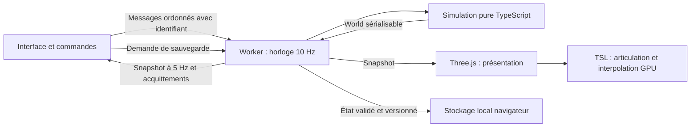

# Architecture et décisions

## Objectif

Obtenir une simulation de colonie déterministe, observable et indépendante de sa représentation 3D. Les événements émergent des règles de travail, de survie et de vie sociale. La fidélité à la référence est documentée par domaine ; la première tranche ne tente pas de livrer tous ces domaines simultanément.

## Frontières et flux

Le worker exécute des ticks fixes de 100 ms. Les vitesses modifient le nombre de ticks, jamais leur signification. Un retard réel est plafonné à 250 ms par passage et à 15 ticks par lot : après suspension du navigateur, le jeu ralentit au lieu de tenter de rattraper des heures. Aucun jour de simulation n'est sauté dans le noyau. Cette politique concerne le temps réel, pas les règles du monde.

Les messages sont traités en séquence dans un worker unique. Chaque commande reçoit une réponse ; un échec est affiché. Un checkpoint complet initialise ou remplace une carte ; les publications suivantes, au plus toutes les 200 ms pendant la marche et après une demande réussie, transportent l'état dynamique et les changements de terrain/ressources. Le client reconstruit un monde complet pour ses observateurs sans recopier les tableaux inchangés. L'application propose 64/128/200/250 cases par côté, défaut 250 ; les anciennes petites cartes sont conservées. Le protocole, ses révisions et les coûts encore complets sont précisés dans ADR-013.

## Contrats actuels

Simulation pure et déterministe dans `src/sim`, messages ordonnés dans `src/bridge`, présentation sans mutation du World dans `src/render`. Les imports vers DOM/Three restent hors du noyau. Le laboratoire GPU reste isolé.

Le schéma courant est 9. Les contrats de propriété, besoins et mouvement font autorité sur les anciennes descriptions des ADR. Voir [simulation](simulation.md), [logistique](material-logistics.md), [alimentation](food-items.md), [agriculture](farming.md) et [mouvement](spatial-motion-storage.md).

Extraire une responsabilité cohérente avant de rallonger un module. Ne pas introduire ECS, Rust ou compute sans besoin et mesure. Les audits séparent simulation, transport des snapshots, rendu CPU et GPU.

## Registre des décisions

Les entrées ci-dessous conservent les anciens liens par fragment. Les textes sont regroupés par domaine, avec leur contexte historique.

## ADR-001 — Grille de gameplay plane, représentation 3D

Voir [la décision détaillée](../decisions/foundations.md#adr-001--grille-de-gameplay-plane-représentation-3d).

## ADR-002 — TypeScript strict dans un worker

Voir [la décision détaillée](../decisions/foundations.md#adr-002--typescript-strict-dans-un-worker).

## ADR-003 — Three.js WebGPURenderer et TSL

Voir [la décision détaillée](../decisions/presentation.md#adr-003--threejs-webgpurenderer-et-tsl).

## ADR-004 — Animation GPU, simulation CPU

Voir [la décision détaillée](../decisions/presentation.md#adr-004--animation-gpu-simulation-cpu).

## ADR-005 — Ressources et réservations explicites

Voir [la décision détaillée](../decisions/simulation.md#adr-005--ressources-et-réservations-explicites).

## ADR-006 — Sauvegarde versionnée

Voir [la décision détaillée](../decisions/simulation.md#adr-006--sauvegarde-versionnée).

## ADR-007 — Rust/WASM et compute selon mesures

Voir [la décision détaillée](../decisions/foundations.md#adr-007--rustwasm-et-compute-selon-mesures).

## ADR-008 — Dimensions, topologie et génération

Voir [la décision détaillée](../decisions/presentation.md#adr-008--dimensions-topologie-et-génération).

## ADR-009 — Organisation de l'interface de référence

Voir [la décision détaillée](../decisions/presentation.md#adr-009--organisation-de-linterface-de-référence).

## ADR-010 — Laboratoire de navigation entièrement GPU

Voir [la décision détaillée](../decisions/presentation.md#adr-010--laboratoire-de-navigation-entièrement-gpu).

## ADR-011 — Adoption critique du référentiel utilisateur

Voir [la décision détaillée](../decisions/foundations.md#adr-011--adoption-critique-du-référentiel-utilisateur).

## ADR-012 — Boucle matérielle, reprise et budgets de planification

Voir [la décision détaillée](../decisions/simulation.md#adr-012--boucle-matérielle-reprise-et-budgets-de-planification).

## ADR-013 — Cartes 250² et publications de monde incrémentales

Voir [la décision détaillée](../decisions/presentation.md#adr-013--cartes-250²-et-publications-de-monde-incrémentales).

## ADR-014 — Désignation de terrain par rectangle

Voir [la décision détaillée](../decisions/simulation.md#adr-014--désignation-de-terrain-par-rectangle).

## ADR-015 — Besoins réalisés par des tâches physiques

Voir [la décision détaillée](../decisions/simulation.md#adr-015--besoins-réalisés-par-des-tâches-physiques).

## ADR-016 — Repas à table, modules de présentation et audits continus

Voir [la décision détaillée](../decisions/simulation.md#adr-016--repas-à-table-modules-de-présentation-et-audits-continus).

## ADR-017 — Ressources graphiques conservées pendant les actions

Voir [la décision détaillée](../decisions/presentation.md#adr-017--ressources-graphiques-conservées-pendant-les-actions).

## ADR-018 — Identité alimentaire et profils sauvegardés

Voir [la décision détaillée](../decisions/simulation.md#adr-018--identité-alimentaire-et-profils-sauvegardés).

## ADR-019 — Arêtes temporisées, sol unique et vue distante

Voir [la décision détaillée](../decisions/presentation.md#adr-019--arêtes-temporisées-sol-unique-et-vue-distante).

## ADR-020 — Surfaces rocheuses et croissance par intégrale

Voir [la décision détaillée](../decisions/presentation.md#adr-020--surfaces-rocheuses-et-croissance-par-intégrale).

## ADR-021 — Caméra et ciel séparés de la simulation

Voir [la décision détaillée](../decisions/presentation.md#adr-021--caméra-et-ciel-séparés-de-la-simulation).

## ADR-022 — Culture, intégrale lumineuse et lots séparés

Voir [la décision détaillée](../decisions/presentation.md#adr-022--culture-intégrale-lumineuse-et-lots-séparés).

## ADR-023 — Dégagement local et décision alimentaire

Voir [la décision détaillée](../decisions/simulation.md#adr-023--dégagement-local-et-décision-alimentaire).
