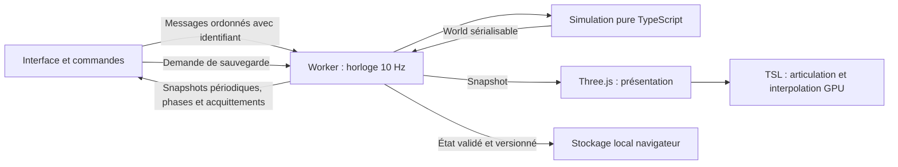

# Architecture et décisions

V79 : `hunting` utilise planner/balistique communs, `corpses` convertit atomiquement identité animale en pile indivisible, `butchery` prévalide viande/cuir/XP/PRNG avant publication. `forHunting` maintient la provenance du rangement sans inventer d'ordre forcé. Corps et produits utilisent les lots graphiques résidents ; `pile-parts` extrait la présentation des objets, `hare-shape` partage vivant/mort. Les plans transparents de curseur/zone utilisent `forceSinglePass` : une surface plane ne nécessite pas les deux passes de faces de Three, et ce choix évite deux variantes GPU tardives après rechargement. [Chasse](hunting.md), [corps](corpses.md), [production](butchery.md).

V78 : `living-melee.ts` partage le coup et les conséquences entre espèces ; `wildlife-melee.ts` possède mémoire/riposte et approche locale bornée. Un seul noyau de lésions, pas de doublon humain/animal. `combat-system.ts` ordonne les acteurs par ID au même sous-pas Core. [Contrat](animal-melee.md).

V77 : modèles anatomiques immuables humain/lièvre consommés par le même noyau médical. Adaptateurs `wildlife-health`, `wildlife-flight`, `wildlife-noise` séparés ; cibles `animal:<id>` dans l’overlay mobile des projectiles. La présentation réutilise les fractions de trajet ralenti. Migration V76 stricte et neutre ; pas de nouveau moteur de santé parallèle. [Contrat](animal-combat.md).

V76 : acteur `WildAnimal` séparé du `Pawn` humain, dans `World.wildlife` sparse. Besoins/repas/navigation/validation répartis entre cinq modules ; navigation, réservations quantitatives, portes et protections de chantier communes. Présentation instanciée TSL résidente, historique de mouvement et clock confirmée partagés avec les colons. Migration V75 stricte et neutre. [Contrat](wildlife.md).

V75 : `cooler.ts` possède faces/consigne/intégration, `cooler-salvage.ts` prévalide le bilan multi-matière avant destruction ; `cold-rules.ts` sépare l’exposition froide dans la boucle médicale commune. Schéma 75, deux progrès de recherche indépendants. `cooler-adjust` traite chaque clic relatif sur l’état autoritaire du worker, sans lire une valeur UI retardée. Géométrie et indications partagent les lots existants. [Contrat](cold-store.md).

V74 : `heatwave.ts` possède le calendrier/RNG indépendant ; `heat-rules.ts` sépare isolation et armure ; `heat-exposure.ts` applique les stades médicaux ; `heat-refuge.ts` emploie la navigation civile ; `heat-save.ts` valide leurs états sparse. `NaturalResourcePresentation` sépare aussi l’invalidation de géométrie forestière des ancres de croissance thermique. Aucun nouveau shader ou calcul médical par image. [Contrat](heatwave.md).

V73 : `research.ts`/`research-save.ts` portent projet collectif et sessions physiques ; `research-panel.ts` expose commandes et état. Le tailleur réutilise la confection par recettes et inachevés typés ; ses pièces procédurales et celles du bureau rejoignent le lot mobilier résident. Aucun moteur de production parallèle, nouveau squelette CPU ou cache par image. [Contrat](research.md).

V72 : `unfinished.ts` possède matière/progression/auteur et annulation transactionnelle ; `tailoring-plan.ts` sélectionne la reprise, `crafting-quality.ts` isole qualité/XP/thermique, `crafting-spot.ts` traite le marquage instantané. Les factures et transports restent communs. Présentation dans les lots résidents et attribut d’équipement existant ; V71 strictement validée avant migration neutre. [Contrat](tailoring.md).

V71 : [coton et tissu](textiles.md) étendent les définitions agricoles et la catégorie de matériaux, sans confondre récolte et nourriture. Deux formes de cultures partagent le gestionnaire de lots résidents ; croissance O(1), transports et bridge communs. V70 strictement validée puis migrée sans ajout de contenu.

V70 : `social-state.ts`, `social.ts`, `social-save.ts` séparent opinions, échanges et validation. État sparse par personne, PRNG indépendant, compatibilité dérivée, capture locale des obstacles construite à la demande sans grille mondiale. Passage déterministe après activités, sans interruption ni réservation nouvelle ; inspection hors frame GPU. [Contrat](social.md).

V69 : `traits.ts` sépare identifiants/définitions gelées, validation et facteurs purs. Traits facultatifs sur Pawn et offre d’accueil, copies distinctes ; bootstrap du nouveau camp explicite. Aucun nouvel index spatial, PRNG, passage par frame ni donnée dérivée persistée. Consommateurs communs humeur/crises/quatre compétences, UI dédiée `traits-inspection.ts`. [Contrat](traits.md).

V68 : `raid-state`, `raid-space`, `raids`, `raid-behavior` et `raid-save` séparent calendrier/groupe, requêtes stratégiques, transitions, actions et persistance. Aucun BFS hypothétique transmis comme mouvement ; les contrôleurs de combat communs gardent impacts/arêtes. Retraits après l’itération des acteurs, registre des objets exportés et migration neutre. [Contrat](raids.md).

V67 : `barriers.ts` engage les dommages/retraits/pertes, `repairs.ts` gère le foyer et le travail, `barrier-save.ts` valide les nouveaux états sparse. Les captures de combat locales vérifient le remplacement de `structures` pour les tirs, projectiles, contacts et sons ; la chute du toit suit le retrait sans réécrire son PRNG. Marqueurs et cellules de foyer réutilisent les lots graphiques. [Contrat](barriers.md).

V66 : calendrier/PRNG privé et données dans `arrival-state.ts`, producteur/acceptation dans `arrivals.ts`, capture ponctuelle d’accès dans `arrival-entry.ts`, validation dans `arrival-save.ts`. UI de lettre séparée ; nouveaux acteurs dans les structures et lots existants. [Contrat](arrivals.md).

V65 : `mental-state.ts` porte les données sparse, `mental-break.ts` orchestre interruption/errance/besoins, `mental-save.ts` valide leur cohérence. Navigation partagée bornée et rendu GPU existant ; âge et PRNG persistés. [Contrat](mental-break.md).

V64 : `mood.ts` sépare situations dérivées, souvenirs existants et jauge persistée. Évaluation commune simulation/inspection, capacité déjà calculée au tick, pas de mutation depuis le HUD ni de traitement par frame. `mood-inspection.ts` possède la liste de causes ; [contrat](mood.md).

V63 : `apparel-rules` définit les deux contenus, `apparel` leur manipulation via l’enveloppe de tâche d’équipement, `apparel-save` valide, `apparel-protection` engage la transaction du noyau pur `armor`. Propriété séparée et projection commune carte/portraits. [Contrat](armor.md).

V62 : `disturbance-state.ts` sépare échéances de sommeil et de posture ; `disturbance.ts` traite les événements physiques, `impact-sound.ts` capture la connexion des espaces. Le combat renouvelle ses cibles après un réveil même sans blessure. [Contrat](disturbance.md).
V61 : `tactics-state.ts` porte le mandat persistant ; `tactics.ts` décide et `tactical-positions.ts` classe les postes avec accès puis une route unique. Les résolveurs de tir/mêlée, santé, navigation et poses GPU restent communs. [Contrat et migration](pursuit.md).

V60 : [acquisition automatique](automatic-combat.md), séparée en décision, score, état et validation. Elle réutilise les producteurs tir/mêlée ; aucun nouvel état graphique ou moteur physique parallèle. Autorisation de tir et réaction civile sont des phases discrètes du bridge ; cible récente/cycle civil sont persistés pour une continuation identique.

V59 : [mêlée](melee.md) séparée en statistiques/outils, espace, impact anatomique, état/validation et orchestration. Tir, mêlée et projectiles partagent les sous-pas Core. Les évaluations anatomiques et personnes portées sont capturées à la demande pendant la transaction, puis invalidées après chaque tentative de mêlée ou impact de projectile, jamais conservées entre ticks. `stun` ajoute des intervalles immobiles à la même arête ; aucun second moteur de déplacement ni rig CPU.

V58 : `affiliation.ts` sépare contrôle et relation ; `combat-navigation.ts` porte le profil hostile commun aux requêtes et au suivi ; `threats.ts` gère la réponse civile et la sentinelle. Le scénario de création reste isolé dans `encounter-scenario.ts`. Aucun moteur anatomique, projectile ou rig dupliqué pour les ennemis. [Contrat](encounters.md).

V57 : `stagger.ts` possède le marqueur d’impact ; `travel-timing.ts` isole les fenêtres et l’intégration de distance. `MotionRecorder` publie des morceaux linéaires de la même arête ; les attributs GPU existants restent communs au corps et aux objets portés. La simulation ne dépend ni des frames ni des poses. [Contrat](stagger.md).

V56 : [tir commandé](shooting.md), séparé en état/validation/exécution et ordonnanceur `combat-system`. Les dix sous-pas communs aux tireurs et balles gardent les fractions de cadence ; XP et impacts restent autoritaires. `ShootingControls` gère uniquement le ciblage ; `ProjectileLayer` conserve les traces confirmées dans un lot TSL, en utilisant la même horloge que les poses. Aucun nouveau moteur générique ni animation de squelette CPU.

V55, [projectiles persistants](projectiles.md) : noyau pur conservé ; `projectile-state/save/system` gèrent enveloppe, validation/migration et sous-pas dans World. `projectile-batch` partage le décor fixe pendant la seule transaction synchrone et renouvelle les cibles mobiles après chaque impact médical. Aucun cache inter-tick ni rendu modifiant World. Le bridge observe émission/arrivée/retrait et supprime les champs dynamiques absents. Commande/XP, phases et rendu ajoutés en V56 ; adversaire, dommages au décor et factions restent ouverts.

V54 : [impacts anatomiques](bullet-impact.md) séparés en résolution sur copie (`bullet-impact`) et engagement World (`bullet-damage`). PRNG engagé avec le dossier, couches du même impact avant réconciliation de l'incapacité. Gunshot versionné, V53 validée avant migration. Le producteur sans armure ne remplace pas le futur résolveur de protections ni les phases de tir.

Sous V53, [socle de tir isolé](combat-queries.md) : grille en lecture seule dans `combat-space`, couvert/rapport dans `combat-report`, profils immuables et unités dans `ranged-statistics`. Pas de mutation ni PRNG caché. La capture World sous V54 utilise des colonnes numériques et des rapports créés à la demande ; [contrat et durée de vie](combat-world.md). Aucun appel par frame ; la boucle de tir est intégrée en V56. Visibilité et occupation/navigation restent distinctes, calcul de précision et compétence persistée aussi.

V53 : [mode tactique](drafting.md) sparse séparé des tâches civiles. Modules règles/destinations/exécution/validation, budgets de navigation communs, UI isolée dans `drafting-controls`. Déclencheurs discrets mode/destination/file observés par le bridge ; aucune nouvelle géométrie ou horloge de rendu.

V52 : [propriété et équipement](equipment.md). La principale est un propriétaire de pile distinct ; règles/actions/incapacité/validation sont séparées dans les modules `equipment-*`. Géométrie du rig extraite vers `pawn-geometry.ts`, petite attache rigide dans le lot GPU existant ; projection commune pour inspection/portrait. Aucun inventaire générique ou moteur de combat anticipé.

V51 : [médicaments](medicines.md), règles/statistiques et logistique dans deux modules ciblés ; réservation source commune, cargaison unique, phases publiées et boîtes GPU existantes. Aucun inventaire personnel ou nouveau lot graphique implicite.

V50 : [décisions urgentes](urgent-care.md) dans un module ciblé, budget de navigation commun, marqueur de tâche sparse et migration sans urgence inventée. Les besoins ordinaires ne coupent pas le soin urgent engagé ; aucun ordonnanceur global supplémentaire.

V49 : [auto-soins](self-tending.md), permission persistante sparse et réutilisation de la tâche/du dossier médical. Le rendu récupère la dernière orientation de marche au chargement, sans état de gameplay graphique supplémentaire.

V48 : [alimentation assistée](feeding.md), état du médecin distinct de la personne nourrie et de la cargaison. `care-access.ts` partage patient/chevet avec les traitements ; sélection alimentaire commune avec destinataire explicite. Trois phases observées, conservation et validation séparées ; aucun nouveau lot GPU.

V47 : [traitements](tending.md), règles/statistiques, repos médical, exécution et validation relationnelle séparés. Médecine réutilise l’apprentissage existant. Le patient garde son dossier unique ; soins et poses sont publiés sur l’horloge commune, sans nouveau lot graphique.

La [création des colons](starting-pawns.md) est extraite de la génération du terrain : profils indépendants entre parties, avec contrôle des mutations numériques et imbriquées. Le scénario documente l'anomalie locale de runtime qui a motivé cette extraction.

V46 : [secours](rescue.md), relation possédée par le porteur, patient conservé comme acteur, rôle du lit et validation dans des modules séparés. Trajectoire GPU partagée et pose portée dans le lot existant ; aucune physiologie dans le rendu.

V45 : [santé active](health.md). Module médical séparé, dossiers sparse par Pawn, règles/évolution/propriété/validation/accident de toit dans des modules distincts. Calcul anatomique réutilisé uniquement dans la décision courante après évolution médicale ; aucun cache entre ticks. Poses de chute et décès dans les attributs GPU existants ; pas de squelette CPU ni de lot supplémentaire.

V44 : [interruption involontaire](interrupted-cargo.md), engagements libérés indépendamment du dépôt, cargaison unique persistante, reprises déphasées et index de sol limité à une décision. Le bridge publie la phase ; aucun ajout aux shaders.

V43 : [compétences](skills.md), données individuelles en milli-XP, horloge déterministe déphasée et premier consommateur Construction. Le renderer ne calcule aucun apprentissage ; la présentation lit les snapshots du worker.

V42 : [électricité](power.md), index de transmetteurs dérivé par propriétaire, états de connexion/alimentation persistants et combustible entier fractionné. Les appareils réutilisent chantiers/transport/thermique et le diffuseur lumineux commun ; phases électriques suivies par le bridge, parties dans le lot de mobilier existant.

V41 : [composants industriels](components.md), registre commun des gisements, flux de génération séparé et chaîne de piles/transport existante. Aucun nouveau système de navigation ni appel de rendu par objet.

V40 : le [refroidisseur passif](passive-cooling.md) partage construction et logistique de combustible ; `thermal-sources.ts` sépare les sources des échanges thermiques. Les pièces et températures persistent sans ID de rendu. Modèle procédural dans le lot de mobilier existant ; préparation du curseur avant le premier geste.

V39 : `thermal-plants.ts` conserve les facteurs des intervalles de croissance et groupe les plantes par volume d’air. Les lectures restent pures ; le [contrat de croissance thermique](plant-temperature.md) couvre migration, semis, toiture et deltas.

V38 : `thermal-topology.ts` possède les preuves spatiales bornées, `temperature.ts` les échanges et le remappage d’air sauvegardé, `thermal-food.ts` les changements de taux alimentaires, `temperature-save.ts` la validation. Aucun calcul thermique dans Three ou dans les frames. [Contrat](temperature.md).

Éclairage 3D sous V36 : [champ dérivé et texture TSL partagée](environment-lighting.md), propres au renderer ; aucune donnée persistante ni nouvel émetteur Three par feu. Les matériaux reçoivent explicitement la configuration à leur création.

Préparation graphique après V28 : les lots vides disposent d’une [passe de préparation des ombres](shadow-preparation.md) avant de devenir visibles en jeu. Elle complète la compilation des deux projections sans modifier la simulation.

V29 : `BoxMesh.ts` extrait transformations TSL, attributs instanciés, capacités et bornes. Les programmes des piles ne dépendent plus d’un identifiant de buffer généré ; leur croissance conserve les programmes partagés. Les minuscules sommets de cube sont possédés par lot, pour une libération indépendante. Voir [contrat et mesure](shadow-preparation.md#croissance-des-piles-v29).

La [synchronisation de présentation sous V38](presentation-timing.md) sépare réception, application de la scène et rafraîchissement du HUD. Les vitesses positives prennent effet dès confirmation ; les transitions de travail/ressource attendent la même horloge que les corps. Les mises à jour continues de scène sont regroupées à 5 Hz ; les phases discrètes restent appliquées au tick de lecture, et les trajectoires GPU avancent à chaque frame.

## Objectif

Obtenir une simulation de colonie déterministe, observable et indépendante de sa représentation 3D. Les événements émergent des règles de travail, de survie et de vie sociale. La fidélité à la référence est documentée par domaine ; la première tranche ne tente pas de livrer tous ces domaines simultanément.

## Frontières et flux

Le worker exécute des ticks fixes de 100 ms. Les vitesses modifient le nombre de ticks, jamais leur signification. `FixedClock` conserve la fraction du tick entre changements de vitesse ; le temps déjà écoulé est traité à son ancien taux avant le changement. Un retard réel est plafonné à 250 ms par passage et à 15 ticks par lot : après suspension du navigateur, le jeu ralentit au lieu de tenter de rattraper des heures. Aucun jour de simulation n'est sauté dans le noyau. Cette politique concerne le temps réel, pas les règles du monde.

Les messages sont traités en séquence dans un worker unique. Chaque commande reçoit une réponse ; un échec est affiché. Un checkpoint complet initialise ou remplace une carte ; les publications suivantes, à la fin des lots actifs de 20 ms et aux transitions visuelles et après une demande réussie (hors requête de menu en lecture seule), transportent l'état dynamique et les changements de terrain/ressources. Le client reconstruit un monde complet pour ses observateurs sans recopier les tableaux inchangés. L'application propose 64/128/200/250 cases par côté, défaut 250 ; les anciennes petites cartes sont conservées. Le protocole, ses révisions et les coûts encore complets sont précisés dans ADR-013.

Sous V52, la comparaison de ressources réutilise des copies ordonnées et réserve les ensembles d’IDs aux changements structurels. Les champs restent tous vérifiés à chaque publication : aucune dépendance à un compteur de mutations, au tick ou à l’identité du tableau. Voir [contrat de transport](presentation-timing.md#coût-de-recherche-des-deltas-sous-v52) et mesures séparées de l’IPC/rendu.

## Contrats actuels

Simulation pure et déterministe dans `src/sim`, messages ordonnés dans `src/bridge`, présentation sans mutation du World dans `src/render`. Les imports vers DOM/Three restent hors du noyau. Le laboratoire GPU reste isolé.

Le schéma courant est 78. [Environnement des ateliers](work-environment.md) : caches dérivés par propriétaire, source lumineuse commune et unités entières de production ; migration V35 validée avant conversion du pourcentage de travail acquis. [Toiture](roofing.md) : couverture/zones persistées, migration V34 sans toit inventé ; contexte de support transitoire et présentation instanciée séparés. Les portes conservent leur état d’ouverture et de permission ; V33 est validée avant migration. La [topologie des pièces](rooms.md) est entièrement dérivée, sans état persistant ni mutation du monde ; l’inspection possède son cache et vérifie les obstacles à chaque lecture utile. Les cinq pierres utilisent les recettes communes, un repos de lit réellement réduit et un bilan de déconstruction par type. La validation V32 précède la migration sans réécriture des objets. `building-materials.ts` porte seulement les propriétés exploitées ; aucune hiérarchie générique de statistiques n’est introduite. La [table de taille](stonecutter.md) réutilise les chantiers et transferts, avec exigences agrégées, emprise centrée 3×1 et géométrie dans un module de présentation dédié. Les [matériaux de construction](construction-materials.md) distinguent recette historique, matériau substituable et exigences typées ; transferts et restitutions conservent le type. Les [gisements et piles d’acier](steel.md) complètent le minage sans régénérer les anciennes cartes ; leur roche encaissante reste distincte du minerai. Le [minage](mining.md) sépare dégâts de roche, cadence de coup, terrain révélé et produit typé. Les [identités géologiques](geology.md) sont persistées et transmises par delta, indépendamment de leur palette de rendu. Le fournisseur ciblé `player-hauling.ts` prépare les livraisons ; `haul-reservations.ts` expose ensemble les tâches actives et en attente au planner. Les contrôles fréquents de capacité et de source parcourent ces mêmes engagements directement, sans tableau temporaire ni générateur. Les ordres restent dans le worker et le rendu ne change pas. Les contrats de propriété, besoins et mouvement font autorité sur les anciennes descriptions des ADR. Voir [simulation](simulation.md), [logistique](material-logistics.md), [alimentation](food-items.md), [agriculture](farming.md), [cuisine](cooking.md), [conservation](food-preservation.md), [horaires](schedules.md), [régimes](food-policies.md), [loisirs](recreation.md), [chantiers](construction.md), [ordres directs](player-orders.md) et [mouvement](spatial-motion-storage.md).

Extraire une responsabilité cohérente avant de rallonger un module. Ne pas introduire ECS, Rust ou compute sans besoin et mesure. Les audits séparent simulation, transport des snapshots, rendu CPU et GPU.

## Registre des décisions

Les entrées ci-dessous conservent les anciens liens par fragment. Les textes sont regroupés par domaine, avec leur contexte historique.

## ADR-001 — Grille de gameplay plane, représentation 3D

Voir [la décision détaillée](../decisions/foundations.md#adr-001--grille-de-gameplay-plane-représentation-3d).

## ADR-002 — TypeScript strict dans un worker

Voir [la décision détaillée](../decisions/foundations.md#adr-002--typescript-strict-dans-un-worker).

## ADR-003 — Three.js WebGPURenderer et TSL

Voir [la décision détaillée](../decisions/presentation.md#adr-003--threejs-webgpurenderer-et-tsl).

## ADR-004 — Animation GPU, simulation CPU

Voir [la décision détaillée](../decisions/presentation.md#adr-004--animation-gpu-simulation-cpu).

## ADR-005 — Ressources et réservations explicites

Voir [la décision détaillée](../decisions/simulation.md#adr-005--ressources-et-réservations-explicites).

## ADR-006 — Sauvegarde versionnée

Voir [la décision détaillée](../decisions/simulation.md#adr-006--sauvegarde-versionnée).

## ADR-007 — Rust/WASM et compute selon mesures

Voir [la décision détaillée](../decisions/foundations.md#adr-007--rustwasm-et-compute-selon-mesures).

## ADR-008 — Dimensions, topologie et génération

Voir [la décision détaillée](../decisions/presentation.md#adr-008--dimensions-topologie-et-génération).

## ADR-009 — Organisation de l'interface de référence

Voir [la décision détaillée](../decisions/presentation.md#adr-009--organisation-de-linterface-de-référence).

## ADR-010 — Laboratoire de navigation entièrement GPU

Voir [la décision détaillée](../decisions/presentation.md#adr-010--laboratoire-de-navigation-entièrement-gpu).

## ADR-011 — Adoption critique du référentiel utilisateur

Voir [la décision détaillée](../decisions/foundations.md#adr-011--adoption-critique-du-référentiel-utilisateur).

## ADR-012 — Boucle matérielle, reprise et budgets de planification

Voir [la décision détaillée](../decisions/simulation.md#adr-012--boucle-matérielle-reprise-et-budgets-de-planification).

## ADR-013 — Cartes 250² et publications de monde incrémentales

Voir [la décision détaillée](../decisions/presentation.md#adr-013--cartes-250²-et-publications-de-monde-incrémentales).

## ADR-014 — Désignation de terrain par rectangle

Voir [la décision détaillée](../decisions/simulation.md#adr-014--désignation-de-terrain-par-rectangle).

## ADR-015 — Besoins réalisés par des tâches physiques

Voir [la décision détaillée](../decisions/simulation.md#adr-015--besoins-réalisés-par-des-tâches-physiques).

## ADR-016 — Repas à table, modules de présentation et audits continus

Voir [la décision détaillée](../decisions/simulation.md#adr-016--repas-à-table-modules-de-présentation-et-audits-continus).

## ADR-017 — Ressources graphiques conservées pendant les actions

Voir [la décision détaillée](../decisions/presentation.md#adr-017--ressources-graphiques-conservées-pendant-les-actions).

## ADR-018 — Identité alimentaire et profils sauvegardés

Voir [la décision détaillée](../decisions/simulation.md#adr-018--identité-alimentaire-et-profils-sauvegardés).

## ADR-019 — Arêtes temporisées, sol unique et vue distante

Voir [la décision détaillée](../decisions/presentation.md#adr-019--arêtes-temporisées-sol-unique-et-vue-distante).

## ADR-020 — Surfaces rocheuses et croissance par intégrale

Voir [la décision détaillée](../decisions/presentation.md#adr-020--surfaces-rocheuses-et-croissance-par-intégrale).

## ADR-021 — Caméra et ciel séparés de la simulation

Voir [la décision détaillée](../decisions/presentation.md#adr-021--caméra-et-ciel-séparés-de-la-simulation).

## ADR-022 — Culture, intégrale lumineuse et lots séparés

Voir [la décision détaillée](../decisions/presentation.md#adr-022--culture-intégrale-lumineuse-et-lots-séparés).

## ADR-023 — Dégagement local et décision alimentaire

Voir [la décision détaillée](../decisions/simulation.md#adr-023--dégagement-local-et-décision-alimentaire).

## ADR-024 — Cuisine physique et recherches de travail par groupes

Voir [la décision détaillée](../decisions/simulation.md#adr-024--cuisine-physique-et-recherches-de-travail-par-groupes).

## ADR-025 — Occupation dense par recherche et diagnostics de cuisine

Voir [la décision détaillée](../decisions/simulation.md#adr-025--occupation-dense-par-recherche-et-diagnostics-de-cuisine).

## ADR-026 — Âge alimentaire ancré et interruption conservatrice

Voir [la décision détaillée](../decisions/simulation.md#adr-026--âge-alimentaire-ancré-et-interruption-conservatrice).

## ADR-027 — Horaires distincts des besoins physiques

Voir [la décision détaillée](../decisions/simulation.md#adr-027--horaires-distincts-des-besoins-physiques).

## ADR-028 — Régimes partagés et engagements alimentaires

Voir [la décision détaillée](../decisions/simulation.md#adr-028--régimes-partagés-et-engagements-alimentaires).

## ADR-029 — Accessibilité progressive et routes à la demande

Voir [la décision détaillée](../decisions/simulation.md#adr-029--accessibilité-progressive-et-routes-à-la-demande).

## ADR-030 — Passage civil et réservations de service

Voir [la décision détaillée](../decisions/simulation.md#adr-030--passage-civil-et-réservations-de-service).

## ADR-031 — Loisirs physiques et lassitude persistante

Voir [la décision détaillée](../decisions/simulation.md#adr-031--loisirs-physiques-et-lassitude-persistante).

## ADR-032 — Plans, cadres et dégagement matériel

Voir [la décision détaillée](../decisions/simulation.md#adr-032--plans-cadres-et-dégagement-matériel).

## Fournisseurs contextuels V19

`player-service-hauling.ts` isole les propositions de ravitaillement et de dégagement du fournisseur de stockage. L’exécution réutilise `HaulTask` et le transport physique commun ; le constructeur conserve son sous-travail de coupe. `fuelStationReserved` partage l’exclusivité du poste entre cuisine, transport actif et file. Aucune donnée de rendu ni recherche à chaque image ; aucune géométrie supplémentaire. Schéma 19 pour les nouvelles destinations en file et le drapeau manuel de recharge, après validation stricte de V18. Voir [contrat et limites](player-orders.md).

## Ordres de cuisine et semis V20

`order-types.ts` sépare les trois entrées de file (job, transport, recette). `player-cooking.ts` adapte le planificateur commun et son exécuteur ; `player-cooking-save.ts` valide la forme initiale stricte avant les références croisées. Sources et capacité au sol comptent les engagements par boucles directes ; postes et dépôts sont partagés avec construction/services. `sowing-clearance.ts` valide l’intention zone/cellule sans dépendre du renouvellement des jobs agricoles. La suppression du parent utilise le plan de dépôt conservatif commun. Schéma 20 après validation stricte de V19, aucun changement de géométrie ni travail par image. [Contrat](player-orders.md).

## Coexistence et zones V21

`occupancy.ts` sépare quatre permissions du catalogue ciblé : dégager une pile, coexister avec elle, admettre une zone et recevoir un apport. `construction-zones.ts` décrit les cellules et destinations affectées puis applique les retraits avec les dépôts préparés par `work-release`. Aucun état d’occupation global mutable ni nouvelle abstraction ECS. L’index des rectangles passe à un masque 16 bits pour distinguer les restrictions ; il reste local à la requête. `occupancy-save.ts` valide la transition des anciens dépôts dans les lits/feux après la validation V20. `render/pile-surfaces.ts` ne fournit que des décalages/échelles de présentation : ID et propriétaire restent dans la simulation, lots de géométrie existants réutilisés. La circulation actuelle est volontairement séparée et doit être complétée au prochain lot ; [contrat et limites](construction.md).

Les requêtes chaudes de présence dans une empreinte utilisent `footprintContains` (définitions centralisées), sans tableau de cellules temporaire. Les profils restent relus sur l’état courant ; aucun cache persistant d’occupation susceptible de devenir périmé n’est introduit.

Les [profils V22](furniture-travel.md) sont isolés de l’orchestrateur : `furniture-travel` pour passage/arrêt/coûts, `transit-exit` pour le repli physique, `furniture-save` pour la migration. `pawn-presentation` centralise la formule TSL corps/cargaison/sélection ; `furniture-motion` indexe les hauteurs par snapshot. Aucun nouvel attribut ni lot de personnages, aucun calcul de squelette CPU ajouté.

## Maintien prioritaire V23

`priority-work-state` sépare intention persistante et réservation, avec validation historique stricte. `priority-work` intervient après la file et avant les besoins ordinaires ; il réutilise les propositions de cuisine/construction/transport, un accès partagé et les budgets du tick. L’orchestrateur reçoit un seul appel. Absence d’intention : aucune recherche supplémentaire. Aucun nouveau mesh, attribut GPU ou dépendance. Voir [contrat et migration](player-orders.md).

## Retrait transactionnel V24

`deconstruction-rules.ts` porte cibles/durées/réservations, `deconstruction.ts` prépare le remboursement avant de supprimer l’ouvrage et `deconstruction-save.ts` contrôle les nouveaux états. Le bilan de pertes est persisté et transmis par les snapshots dynamiques. `JobLayer.ts` extrait les marqueurs du rendu principal et réutilise les lots instanciés. Voir [contrat et limites](deconstruction.md).

## Mobilier conservé et transport V25–V26

Les [transferts de meubles](furniture-transfer.md) séparent règles, commandes, progression et validation. `World.packed` garde l'objet construit et son propriétaire sol/colon ; le rendu présente ces données sans les modifier. Les représentations de paquet utilisent les lots existants de mobilier et cargaisons GPU. La migration V24 est additive après validation stricte ; aucun inventaire personnel ni registre ECS générique n'est introduit. La [logistique V26](furniture-logistics.md) étend les tâches actives/en file par `whole: true`, réserve une cellule entière, conserve le fournisseur Construction/Transport de la réinstallation et ajoute un filtre de réserve facultatif. V25 est validée avant migration, sans changer les réglages existants. Les règles, propositions, exécution et validation des paquets restent dans des modules dédiés. Les capacités des réserves sont réutilisées uniquement pendant une décision synchrone ; elles ne survivent ni à sa réservation finale ni à un tick.

## Production commune V32

Deux recettes partagent le même moteur physique. `production-recipes.ts` décrit leurs contrats et `production-output.ts` extrait livraison/fractionnement ; noms persistants `cooking` conservés, recette de blocs explicitement discriminée. Pas de nouveau moteur de réservations. Les recherches de réserve utilisent l'accès progressif commun, uniquement pendant une décision synchrone. [Contrat](stonecutting.md).

## Portes et audit de charge V34

[Portes manuelles](doors.md) : attente avant engagement de l'arête, permission distincte de l'état ouvert, temporisations sauvegardées. Index des corps et objets local à la mise à jour ; recherche/candidats toujours bornés à une décision synchrone. Jambages dans le lot statique partagé, vantaux instanciés par attributs et TSL sur le temps des colons. Aucun nouveau solveur physique ni animation CPU par objet.

Le scénario 100 portes/100 colons a révélé un coût CPU élevé avec 1 500 murs et recherches simultanées. L'[optimisation des requêtes](spatial-queries.md) compare le classement avant accès/capacité, capture les cellules d'arrêt pendant une recherche de sortie et évite les allocations d'empreintes dans les loisirs. Les mêmes états de charge sont conservés, avec des pointes CPU encore ouvertes ; voir [mesures](validation.md). Aucun cache persistant implicite ne doit masquer une création, un déplacement de pile ou un changement d'autorisation.

## Sauvegarde locale et remplacement V35

Pendant une sauvegarde manuelle, les commandes de sauvegarde et de chargement sont désactivées jusqu’à écriture effective dans le stockage local. Un chargement rapide ne lit donc plus l’ancienne entrée pendant que la réponse du worker arrive. Échec d’écriture : les boutons sont restaurés et le monde courant reste en place. Les raccourcis utilisent la même garde ; la simulation n’est pas modifiée par le test de réponse retardée.

### Lumière des actions V37

`light-environment.ts` sépare lecture lumineuse et rôles de `work-environment.ts`. La simulation injecte un contexte partagé aux départs d'arêtes et aux actions, invalidé après mutation. `work-progress.ts` et `work-progress-save.ts` possèdent unités fractionnaires et migration ; ni rendu ni navigation ne deviennent propriétaires de l'avancement. [Contrat](light-work.md).

## Anatomie : frontière préalable à la santé

`body-definition.ts` garde le corps naturel et ses index immuables, distincts du squelette GPU. `body-capacities.ts` évalue une projection de pertes/absences/douleur, avec résultat immuable et voie saine partagée. Le modèle ne possède pas `World` et ne déclenche ni mort ni interruption. [Contrat anatomique et intégration V45](body.md). Aucun champ de sauvegarde n’est ajouté pour ce socle seul.
