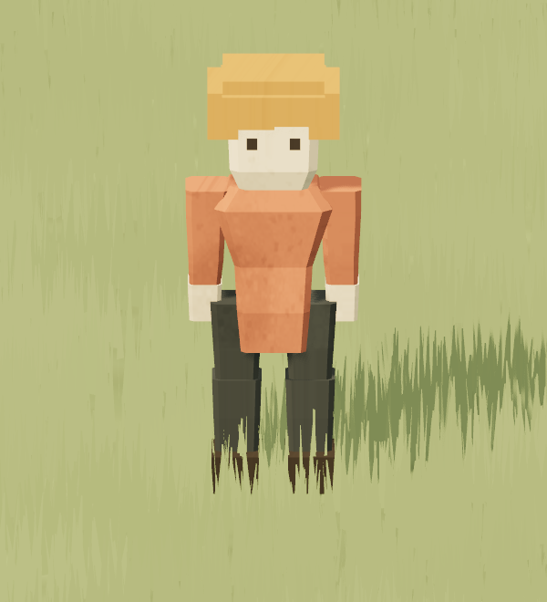
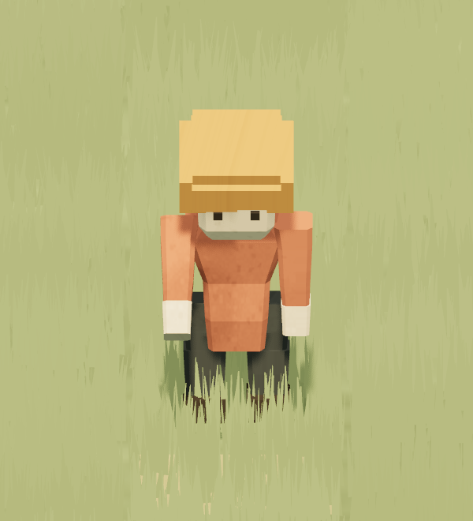
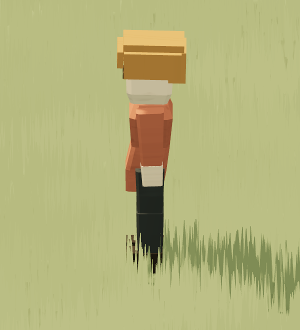
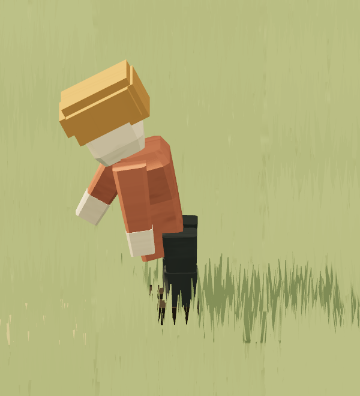

# Validation V136 — raccords du colon

Le maillage V135 (commit `0bbe6ae`) dessinait le torse et le bassin comme deux boîtes fermées superposées. Le contrôle `actor-model-v135.test.ts` vérifiait leur recouvrement, mais pouvait passer avec deux caps internes et une ligne d'éclairage à la taille. V136 remplace ces deux volumes par une seule enveloppe extérieure indexée. Ses anneaux intermédiaires modèlent la taille et le bassin sans face de fermeture entre eux.

Le contrôle `tests/pawn-junction-v136.test.ts` soude les positions identiques indépendamment des indices de dessin. Il vérifie que chaque arête du tronc appartient à deux triangles, que toutes les faces appartiennent à une seule composante et qu'aucun triangle horizontal ne bouche la taille. Il évite donc de prendre une simple superposition de boîtes pour une jonction continue. Le même contrôle borne le lot humain à **2 296 sommets transformés** (+10 % par rapport aux 2 088 de V135), sept flux de sommets et seize attributs actifs. Le résultat mesuré est **2 154 sommets**, soit +66 (+3,16 %). Les deux tests V136 passent.

Le parcours `tests/integration/pawn-junction-v136.spec.ts` recharge deux variantes du **même colon** à la même cellule et au tick 3 000, puis les fige : debout (`aMotion.z=0`) et au travail au sol (`aMotion.z=16`). Il confirme le backend WebGPU, le lot d'un acteur et l'absence d'erreur console. Les captures orthographiques sont alignées sur l'orientation locale du colon, à zoom 9,5, en face et de profil. Les signes de travail sont masqués pendant la capture afin de laisser le corps lisible ; ils restent présents dans le jeu.

Validation locale : `npm test -- tests/pawn-junction-v136.test.ts` (2/2), `npm run test:integration -- tests/integration/pawn-junction-v136.spec.ts --output=artifacts/pawn-junction-v136-results` (1/1), et `npm run typecheck` passent.

| Vue | Debout | Accroupi |
| --- | --- | --- |
| Face |  |  |
| Profil |  |  |

La taille du vêtement se resserre puis s'élargit vers le bassin sans marche de boîte ni trou au pli accroupi. La preuve de continuité porte sur **tronc+bassin**. Bras, mains, cuisses et mollets conservent des enveloppes articulées distinctes : leurs plis restent visibles sur les captures et leurs jonctions ne sont pas soudées topologiquement pour toute rotation. La vérification ne mesure pas le temps GPU ou un gain de FPS.

La vérification finale groupée passe : build de production, **21 tests ciblés dans six fichiers** et trois parcours Chromium/WebGPU (jonctions humaines, silhouettes animales, arme debout/couchée). Le pilote long `npm run test:presentation` passe pour minage et abattage : 10 659 et 10 735 images, p95 à 4,3 ms dans les deux cas, aucun saut de pose ni occupation de roche. Ce pilote ne compare pas V135 et V136 à charge identique et ne mesure pas le temps GPU ; la hausse des triangles du corps ne peut donc pas être qualifiée de gratuite.
